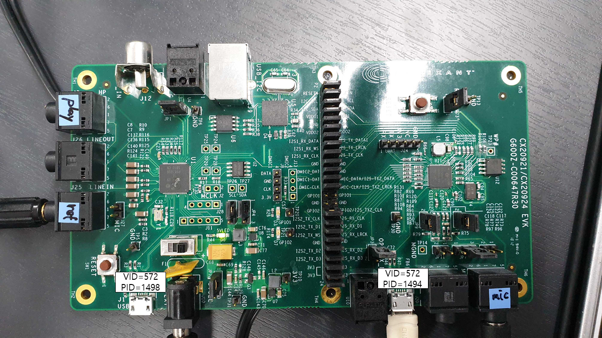

# DS20921-EVK    
Get data from both port(left,right)    
firmware changed by right port.  

## Speaker  
3ch : 1ch : speech    
      2ch : noise 1  
      3ch : noise 2  

## OUTPUT SIGNAL  

+ right port  
6-channel
16kHz

1ch - original left   
2ch - original right  
3ch - reference left   
4ch - reference right   
5ch - mixed original mic    
6ch - processed output    
  
+ left port    
2-channel    
16kHz     
  
1ch - mixed original mic    
2ch - processed output  
