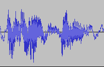

# Experiment-Audio

## Clone
Need to clone submodules.  
```
git clone --recursive https://github.com/kooBH/Experiment-Audio
```
if you already cloned,
```
git submodule init
git submodule update
```

## Usage   
Use ```AudioProbe``` to get device info.  
Set parameters in ```main.cpp```.  
Build.  
Run script.  

## Dependency

+ ubuntu
```
sudo apt-get install libasound2-dev
```

# ISSUES

## Power
The supply of power must be stable.  
If a speaker makes undesired noise or a recorded data seems weird,   
make sure **every** power source is stable.   

+ case 1  
recorded audio plot was unstable.  
    
Solved by Changing the adaptor of the recorder from  12V 2.0A to 12V 3.5A  
  
+ case 2   
When a board was connected to PC, speakers made high-freq noises.  
It was found out that a monitor adaptor  which was not directly connected 
to the board was a problem.  
  
+ case 3  
If a speaker makes high-freq noise when connected to PC by analog jack and can't figure out what is a problem,  
It is useful to use an audio interface.  
